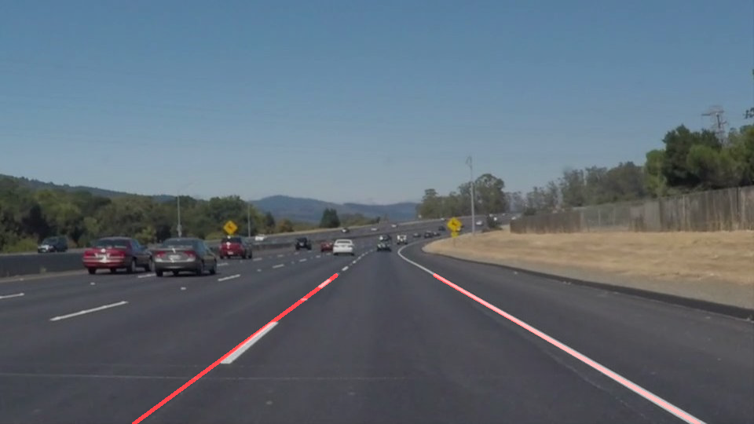
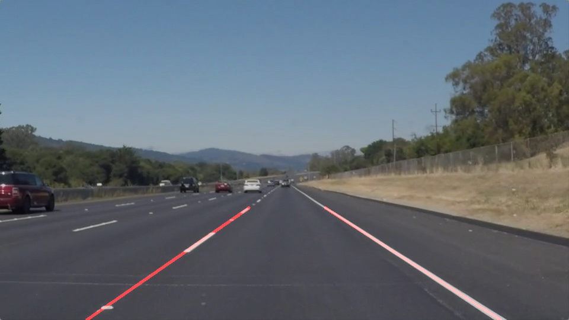
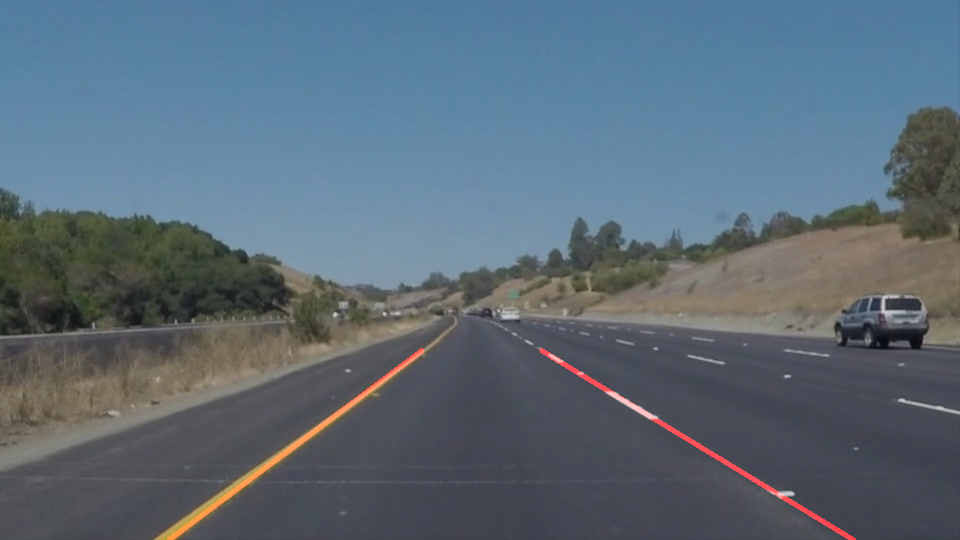

# **Finding Lane Lines on the Road** 

---

The goals / steps of this project are the following:
* Make a pipeline that finds lane lines on the road
* Reflect on your work in a written report

---

### 1. Current pipeline using OpenCV

My pipeline consisted of 6 steps. 

1. Converted images to grayscale.

2. Reduced noise by using `gaussian_blur` function with kernal size 5

3. Implemented Canny with threshold values 50,150 (1:3) ratio to find edges. 

4. Masked image using `region_of_interest` function. Ran this multiple times to find out exact vertices for polygon cut, to include only Lane Lines

5. Using `hough_lines` which inturns calls `draw_lines()` function highlited lines using rho value 2 and theta value 1 

6. Used `weighted_img` function to overlap line image with original. 

## Image Results. 

## Changes in draw_line() function.

* To attain the output as shown, we need to draw a single line instead of mulitiple lines. This part was trick. 

1. I tried to solve it by dividing left lane and right lane using slop direction.

Then calculated `m` and `b` for all points using `np.polyfit`. Then using `y=mx+b` got x cordinates by fixing y cordinates. 

But this process failed to draw lines correctly on videos. 

2. Divided all lines to left and right using slop. 

calculated avg slop and center for both left and right. 

Fixing Y cordinates calculated X cordinates using avg slop and center points. 

### 2. Identify potential shortcomings with your current pipeline

* Manually adjusting vertices for area of interest. This is implemented basing on fact that camera is always placed at one place, which may fail for different cars. 

* Using slop conditions to plot lines fails with curve lines. 

### 3. Suggest possible improvements to your pipeline

* Inspite plotting one line for right and left, we can plot multiple lines depending on change in slop, this can potentially help with curve lines. 

* A dynamic approch to get area of interest inspite of manual trying out different vertices. 