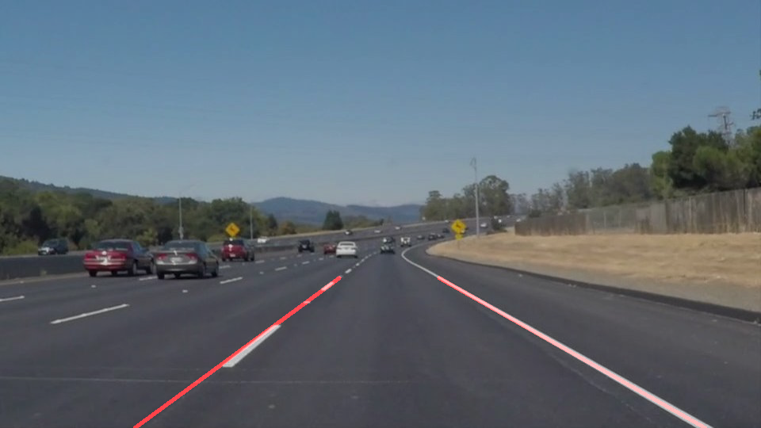
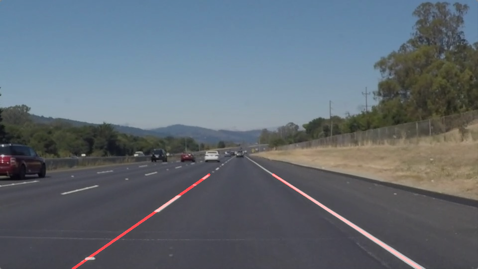
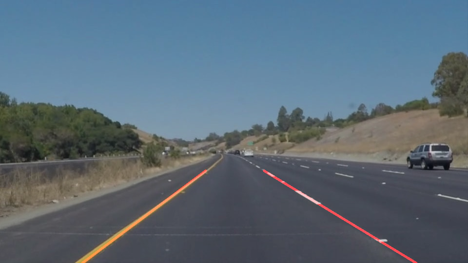
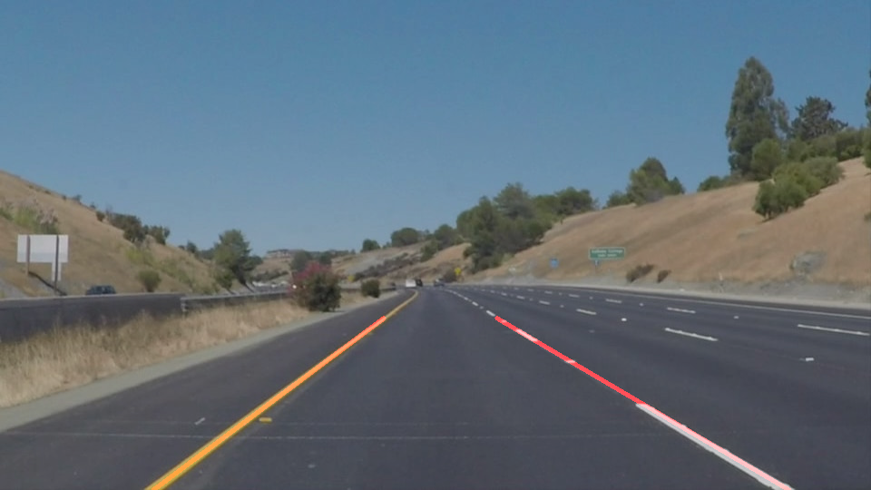
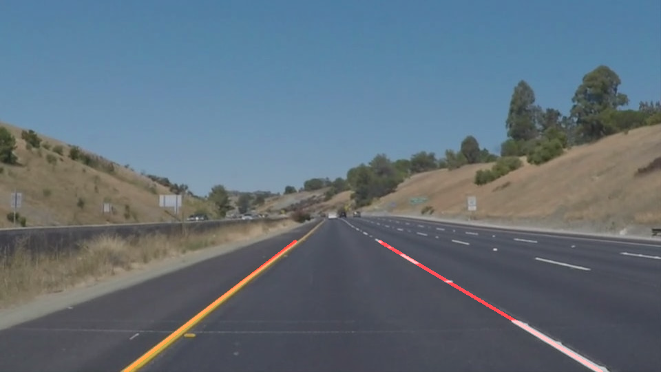

# **Finding Lane Lines on the Road** 

---

The goals / steps of this project are the following:
* Make a pipeline that finds lane lines on the road
* Reflect on your work in a written report

[//]: # (Image References)

[result1]: ./output_images/solidWhiteCurve.jpg "Result1"
[result2]: ./output_images/solidWhiteRight.jpg "Result2"
[result3]: ./output_images/solidYellowCurve.jpg "Result3"
[result4]: ./output_images/solidYellowCurve2.jpg "Result4"
[result5]: ./output_images/olidYellowLeft.jpg "Result5"
[result6]: ./output_images/whiteCarLaneSwitch.jpg "Result6"
---

My pipeline consisted of 6 steps. 

1. Converted images to grayscale.

2. Reduced noise by using `gaussian_blur` function with kernal size 5

3. Implemented Canny with threshold values 50,150 (1:3) ratio to find edges. 

4. Masked image using `region_of_interest` function. Ran this multiple times to find out exact vertices for polygon cut, to include only Lane Lines

5. Using `hough_lines` which inturns calls `draw_lines()` function highlited lines using rho value 2 and theta value 1 

6. Used `weighted_img` function to overlap line image with original. 

## Changes in draw_line() function.

* To attain the output as shown, we need to draw a single line instead of mulitiple lines. This part was trick. 

First, I tried to solve it by dividing left lane and right lane using slop direction.

Then calculated `m` and `b` for all points using `np.polyfit`. Then using `y=mx+b` got x cordinates by fixing y cordinates. 

But this process failed to draw lines correctly on videos. 

Secon

In order to draw a single line on the left and right lanes, I modified the draw_lines() function by ...

If you'd like to include images to show how the pipeline works, here is how to include an image: 

### 2. Identify potential shortcomings with your current pipeline

One potential shortcoming would be what would happen when ... 

Another shortcoming could be ...

### 3. Suggest possible improvements to your pipeline

A possible improvement would be to ...

Another potential improvement could be to ...
